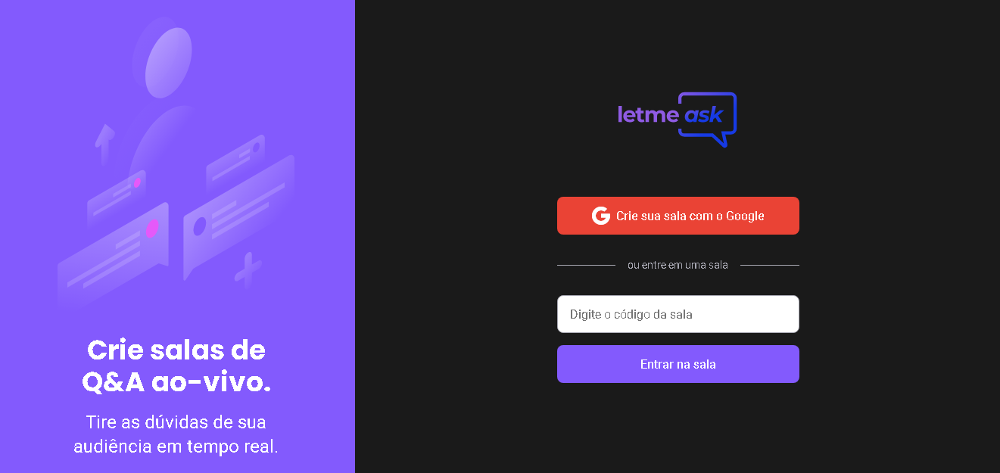
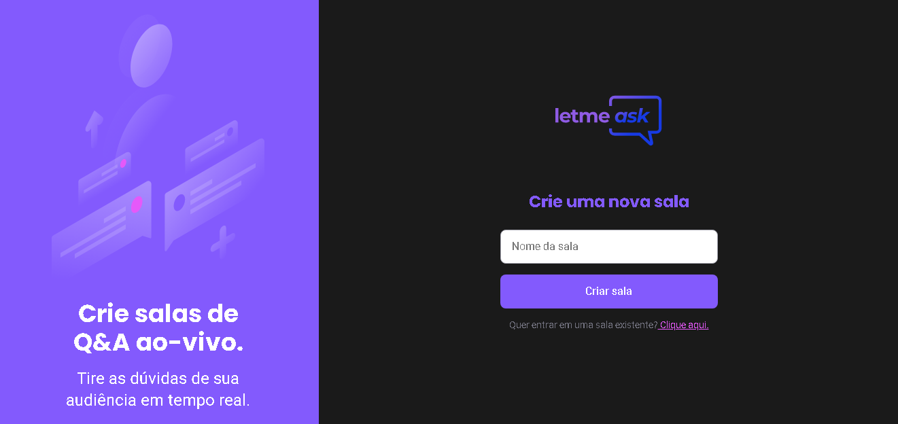
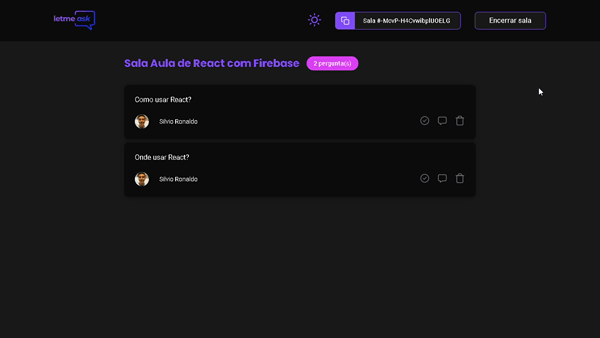
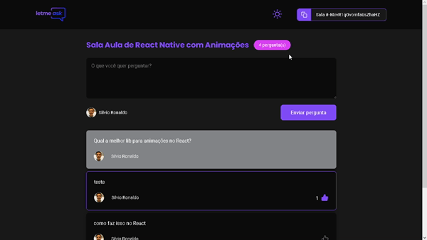
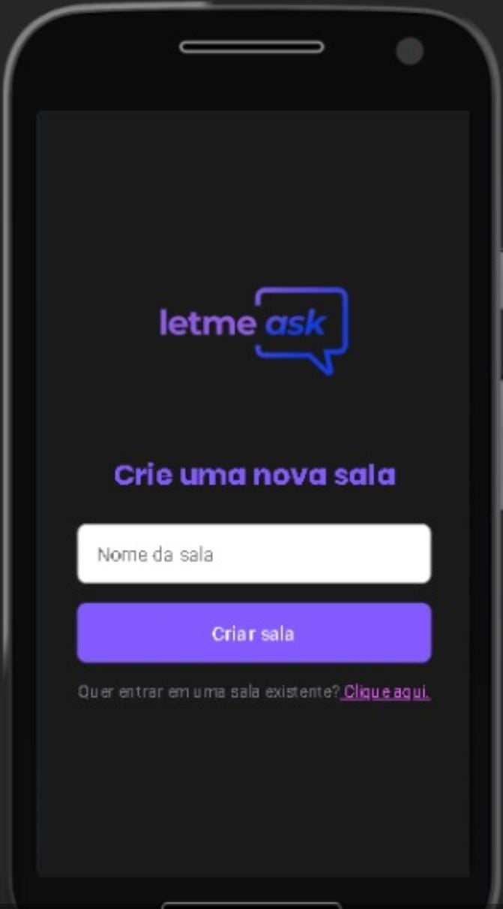
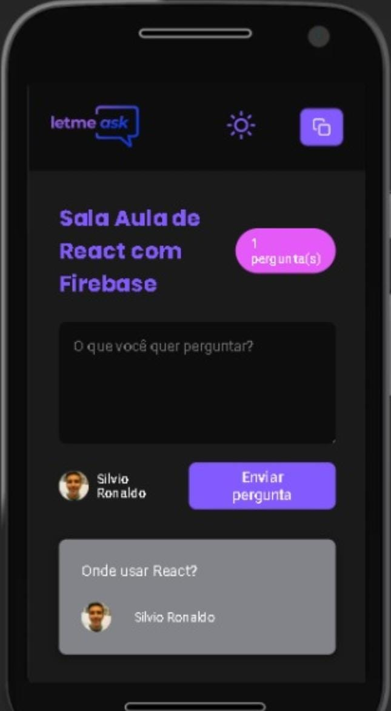
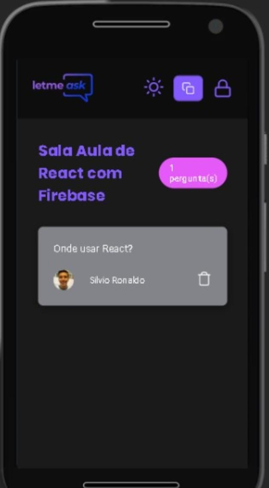
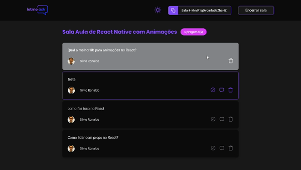
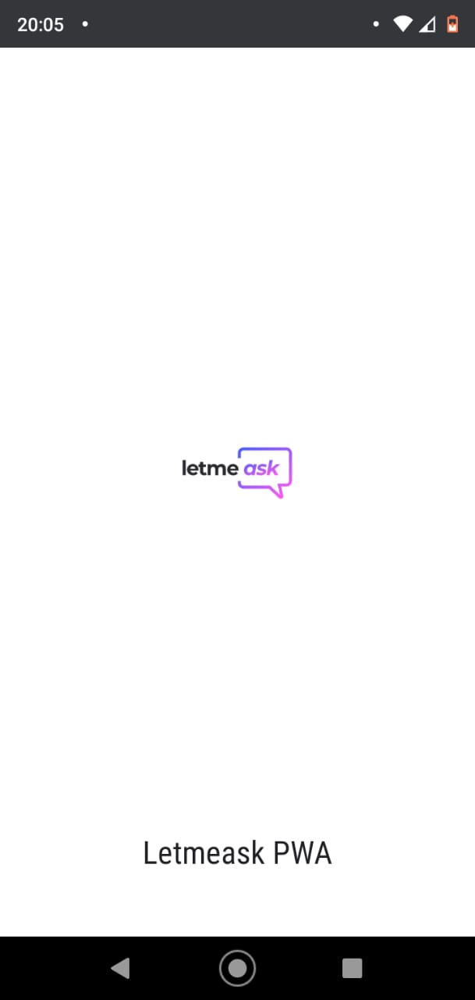

<h1 align="center">
  
</h1>

<strong>💬 Letmeask is an application for help the people with the questions while in streams live in Youtube, Twitch, or any other platform.</strong> Developed at NLW#6 Practical project for study

  
  
  
  
  
  

<h2>
  📋 Table of contents
</h2>
<ul>
  <li><a href="https://github.com/Silvio-Ronaldo/Letmeask#-status">Status</a></li>
  <li><a href="https://github.com/Silvio-Ronaldo/Letmeask#%EF%B8%8F-demonstration">Demonstration</a></li>
  <li><a href="https://github.com/Silvio-Ronaldo/Letmeask#-extra-features">Extra Features</a></li>
  <li><a href="https://github.com/Silvio-Ronaldo/Letmeask#%EF%B8%8F-running-locally">Running Locally</a></li>
  <li><a href="https://github.com/Silvio-Ronaldo/Letmeask#-firebase">Firebase</a></li>
  <li><a href="https://github.com/Silvio-Ronaldo/Letmeask#%EF%B8%8F-technologies">Technologies</a></li>
  <li><a href="https://github.com/Silvio-Ronaldo/Letmeask#-author">Author</a></li>
  <li><a href="https://github.com/Silvio-Ronaldo/Letmeask#%EF%B8%8F-license">License</a></li>
</ul>

<h2>📌 Status</h2>
<h4 align="center">🚧 Letmeask is active. 🚀</h4>

<h2>🖥️ Demonstration</h2>

  <strong>To access and test the Letmeask platform, click on the link: https://letmeask-daa0e.web.app</strong>

<h3>Enter an existing room</h3>
  

    
  

<h3>Sign in and Create your own room</h3>
  

    
  

<h3>Clear your doubts and follow up on others' doubts</h3>
  

    
  

   
  
<h3>🔐 For admin! 🔐 Manage the room, highlight questions and remove questions at any time.</h3>
  

    
  

   

<h2>🔥 Extra Features</h2>
<h3>Dark Mode</h3>
  

    
  

<h3>Responsive</h3>
  

    
    
  
 
  
  

    
    
  
 
  
<h3>Modal</h3>
  

    
  

  
<h3>PWA</h3>
  

    
    
  

  
  
<strong>🆕 New extra features are in development... ⚒️</strong>

  
  
<h2>🕹️ Running locally</h2>
<h3>Prerequisites</h3>
<ol>
  <li><strong>Installing Git:</strong> You need to have Git on your machine to perform a few steps. To download Git, click <a href="https://git-scm.com/downloads">here.</a></li> 
  <li><strong>Installing Yarn 1:</strong> Yarn is a package manager that you can download directly from the website by clicking <a href="https://classic.yarnpkg.com/en/docs/install#windows-stable">here.</a> If you prefer, use the NPM.</li> 
  <li><strong>Code Editor (optional):</strong> Make sure you have a code editor of your choice. I recommend using the VS Code. If you need to, download it <a href="https://code.visualstudio.com/Download">here.</a></li>
</ol>

<h3>Running the React App</h3>
<ol>
  <li>In a terminal, clone this repository:
    
<code>git clone https://github.com/Silvio-Ronaldo/Letmeask.git</code>

  </li>
  <li>Enter the project folder:
    
<code>cd Letmeask</code>

  </li>
  <li>Install all dependencies:
    
<code>yarn install</code> or <code>yarn</code>

  </li>
  <li>Start the development server:
    
<code>yarn start</code>

  </li>
  <li>After these steps, the server should start at the <strong>3000</strong> port, open the browser and access <a href="http://localhost:3000">http://localhost:3000</a>.</li>
</ol>

<h3>Running Letmeask PWA</h3>

To install PWA, access the Letmeask platform through Chrome or Edge browsers, both on your smartphone and on your computer and click on install application.
 

<h2>🟠 Firebase</h2>

<i>Attention: Letmeask uses the Realtime database provided by Firebase. So, if you download the code and run it on localhost and if you want the application to work correctly on your machine locally, create an account in Firebase, and configure the Realtime database according to the rules present in the file database.json. After that, get your app credentials from the Firebase console and put it in the .env according to the .env.example!</i>
 

<h2>🛡️ Technologies</h2>

The following tools were used in the development of the project: 

<ul>
  <li><a href="https://pt-br.reactjs.org">React</a></li>
  <li><a href="https://firebase.google.com/?hl=pt">Firebase</a></li>
  <li><a href="https://firebase.google.com/docs/database">Realtime database</a></li>
  <li><a href="https://www.typescriptlang.org">TypeScript</a></li>
  <li><a href="https://styled-components.com">Styled Components</a></li>
  <li><a href="https://unform.dev">Unform</a></li>
  <li><a href="https://eslint.org">Eslint</a></li>
  <li><a href="https://prettier.io">Prettier</a></li>
  <li><a href="https://github.com/reactjs/react-modal">React Modal</a></li>
  <li><a href="https://react-icons.github.io/react-icons/">React Icons</a></li>
</ul>

<h2>👽 Author</h2>
<table>
  <tr>
    <td align="center"><a href="https://github.com/Silvio-Ronaldo"> <b>Silvio Ronaldo</b></a> <a href="https://github.com/Silvio-Ronaldo" title="Silvio Ronaldo">🍀</a></td>
  </tr>
</table>

Leave your star, fork the project or open a pull request ❤️

Contact me on social networks: 

<h2>⚖️ License</h2>

<strong>Letmeask is MIT licensed, as found in the <a href="./LICENSE">LICENSE file</a>.</strong>

  
  

  
  
 

